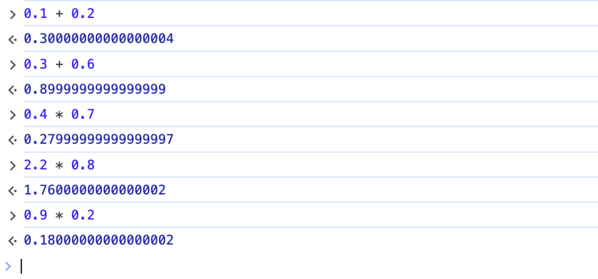
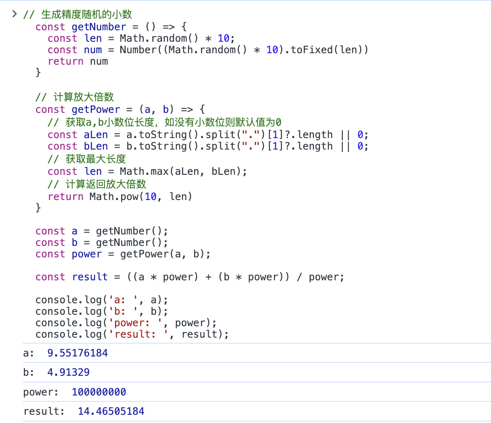
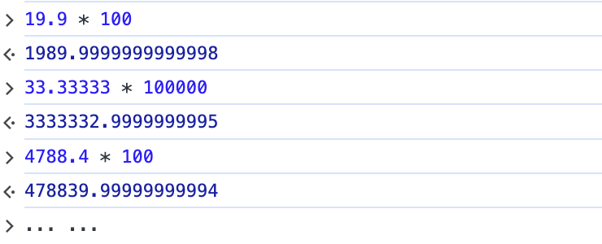

## 故事从0.1+0.2说起

<strong><code>0.1+0.2是否等于0.3呢?</code></strong>

这是一个前端人耳熟能详的故事，每一个初入前端世界的人，应该都会被它来一次灵魂拷问。它的出现，似乎打破了人们以往对于代码世界<code>“执行严谨、一丝不苟”</code>的刻板印象。然而，这看起来<code>“不够严谨”</code>的形成原因，却正是因为<code>底层代码执行的足够严谨</code>！

在初入前端世界的时候，有那么一瞬，我甚至在想<code>难道是底层对于<strong>0.1</strong>和<strong>0.2</strong>有一种特殊的感情？</code>

然而事实并非如此，能被底层这种庞然大物看上并针对的，当让不会只有<code><strong>0.1</strong></code>和<code><strong>0.2</strong></code>这两个看起来平平无奇的数字，而是包含了这两个数字在内的一批特殊存在。

如下图所示：



当然，除上述图片内的数字之外，还有更多的其他数字也在这反常理的队列之内。

然而，这篇文章我们并不是来讨论这些特殊的数字在进行数学计算时，与底层究竟产生了什么样的恩怨纠葛。我们只是<code>**针对已有问题，提出合理解法**</code>。

## 初步解决

依据传统，在<code>javascript</code>中进行小数计算，通常会采用放大倍数取整之后再计算，得出结果之后再缩小还原的技术方案。
> 例：计算0.1+0.2，通常会将0.1和0.2放大10倍，相加之后再缩小10倍

代码如下：

```js
  /**
   * 已知：a为0.1，b为0.2
   * 求：a与b的和
   * */
  const a = 0.1;
  const b = 0.2;
  const result = ((a * 10) + (b * 10)) / 10;
  console.log(result) // 0.3
```

如上，针对已知小数位数的数字，我们可以直接`采用放大相应倍数取整，然后再计算的方式`来规避小数计算的精度问题。

可是在实际的业务开发中，对于需要进行计算处理的数字，我们往往无法预先获知数字包含的小数位数。对于此种情况，我们便`需要先确定小数位数，然后确定放大倍数，再进行计算。`

代码如下：

```js
  /**
   * 已知：a，b为两个精度随机的小数
   * 求：a与b的和
  */

  // 生成精度随机的小数
  const getNumber = () => {
    const len = Math.random() * 10;
    const num = Number((Math.random() * 10).toFixed(len))
    return num
  }

  // 计算放大倍数
  const getPower = (a, b) => {
    // 获取a,b小数位长度，如没有小数位则默认值为0
    const aLen = a.toString().split(".")[1]?.length || 0;
    const bLen = b.toString().split(".")[1]?.length || 0;
    // 获取最大长度
    const len = Math.max(aLen, bLen);
    // 计算返回放大倍数
    return Math.pow(10, len)
  }

  const a = getNumber();
  const b = getNumber();
  const power = getPower(a, b);

  const result = ((a * power) + (b * power)) / power;
```

因为以上代码中，`a`和`b`皆由`getNumber`函数随机生成，为了便于观察，我们添加`log`后，在浏览器中运行代码。

如下图所示：



观察可知，计算结果正确。以上，我们通过使用`getPower`函数确定放大的倍数，然后进行计算。这也是目前大部分同学解决小数计算精度问题的主要方式。

<strong>`然而，故事到这里就结束了吗？`</strong>


<strong>`当然不是！`</strong>

以上方式虽然解决了一些精度问题，但是并没有解决所有的精度问题。在这个特殊的小数群体中，`并不是所有的小数都可以通过放大倍数来取整的！`

如下图所示：



## 大胆取舍

## 封装完善

## 结语


<!-- 19.9 * 100 -->
<!-- 23.26*10 -->
<!-- 33.33*10 -->
<!-- 33.33333*100000 -->
<!-- 4788.4*100 -->

